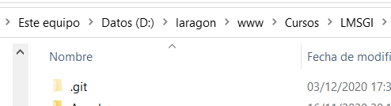
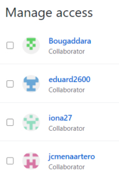
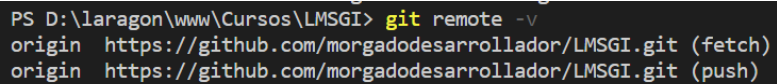
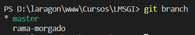
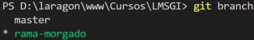
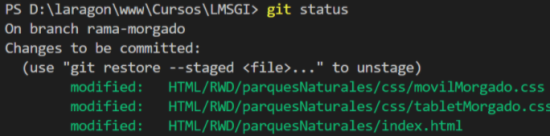
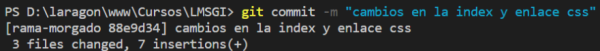
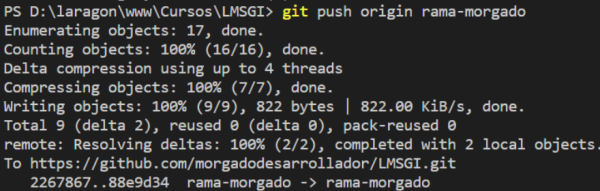
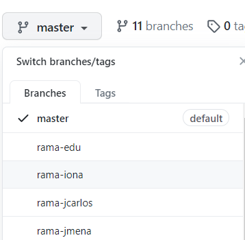

**Índice**
1. [Hacer un push en el repositorio remoto de Clase](#id1)
2. [Configuraciones iniciales](#id2)
3. [Modificamos nuestro proyecto y actualizamos el repositorio remoto](#id3)
4. [Descargar Actualizaciones del master](#id4)
5. [Descargar otras ramas del repositorio remoto](#id5)
6. [Creación de una nuevo repositorio](#id6)
# Hacer un push en el repositorio remoto de Clase<a name="id1"></a>
La idea es 
* Debemos de configurar con git config el user.name, user.email y user.password
* poder realizar un pull del repositorio
* Crear una rama local con nuestro nombre rama-usuario
* Realizar el diseño de la práctica/examen. En este proceso usaremos git status, git add, git commit de modo que vayamos añadiendo ficheros al nuevo escenario y realicemos los snapshots con git commit
* Podemos ver la evolución con git log
* Finalmente subiremos las modificaciones de los diferentes commits al repositorio de clase con git push
## Configuraciones iniciales<a name="id2"></a>
  ### 1. Creamos un repositorio local
   Nos vamos a nuestro direcorio del proyecto y hacemos un  
   `$git init` Esto provoca la creación de un **repositorio local** en nuestra máquina para este directorio.
     
   En este directorio oculto se almacenarán todos los metadatos, caches necesarias para que git pueda trabajar (stages o escenarios, snapshots, archivos de logs ...)  
   > Hemos de entender que una cosa es el trabajo con **git** (status/add/commit/logs ...) y otra cosa es publicar los proyectos en **GitHub**  
  ### 2. Creamos un usuario en Github.com 
   Debemos de apuntar el username/email/password  
   Para hacer push en repositorio de clase hemos de facilitar nuetro **username** para que el profesor nos añada como colaboradores en el repositorio de clase  
    
  ### 3. Descargamos el repositorio remoto (pull)  
   No es lo mismo que CLONAR. 
   * Nos situamos en un directorio de trabajo LMSGI y agregamos un **origen remoto** con el siguiente comando:  
   `$ git remote add origin https://github.com/morgadodesarrollador/LMSGI.git`  
   Este origen podría cambiar:  
   `$ git remote add originRepLMSGI https://github.com/morgadodesarrollador/LMSGI.git`  
   El  **origen remoto** puede ser de github, git azure, git Lab ...   
   Hacemos la siguiente comprobación:  
     ```
      $ git remote  
      $ git remote -v
     ``` 
     
   * Como nuestro repositorio local está vacío, vamos a crear la rama **master** en nuestro **repositorio local**. Hacemos:  
    `$ git checkout -b master`  
    verificamos que la rama ha sido creada y es activa: 
     `$ git branch`  
      
   * Nos descargamos la **rama master** (se entiende que es la rama por defecto) del repositorio remot de GitHub (**origin**) a la rama **master** de nuestro **repositorio local** en nuestro ordenador:  
    `$ git pull origin master`  
    Nuestra rama **master local** tendrá el contenido de la rama **master remota**  
    En VSCODE aparacerá el nuevo contenido. VSCOde se integra con todas las funcionalidades de git. Abajo a la izquierda nos indica la **rama activa** que hay en el repositorio local. Debemos de tenerlo siempre presente a la hora de hacer **pull** (descargaas del repositorio remoto) y no destrozar así las ramas.  
      
    Toda esta información se guarda en el directorio oculto **.git**, que está oculto para que pase desapercibido y no lo borreis ...  
  ### 4. Crear una rama paralela para nuestro desarrollo  
  La idea es crear una rama personal distinta a la master, para realizar nuestros desarrollos, con el objetivo de que subas tus prácticas o proyectos  
  La rama **master** se deja libre para mantener el **código en producción** sin errores.
  En paralelo crearemos **ramas auxiliares** quen contienen modificaciones o nuevas funcionalidades que serán el **código en desarrollo**, de modo que estas modificaciones NO MODIFIQUEN el código en producción hasta que no estén aceptadas y se fusionen con la rama master.  
  `$ git checkout -b rama-morgado`  
  Este comando provoca la creación de la rama y la selección/activación de la misma   
  Ejecutamos git branch para verificar ...  
    
  > **Nota** es importante el orden de los pasos. Si hacemos (4) antes que (3), debemos de mezclar ambas ramas:  
    `$git merge rama-morgado master`  
    Pero esto lo dejaremos para otro documento ...
## Modificamos nuestro proyecto y actualizamos el repositorio remoto<a name="id3"></a> 
   ### 1. Realizamos cambios en el código  
  * Creamos/modificamos/borramos ficheros ...
  * Modificamos los css para hacer el rwd ...
  * Creamos/borramos carpetas, añadimos/borramos imágenes, ficheros ...
  * Cualquier cosa...
   ### 2. Crear un nuevo SNAPSHOT(commit) en nuestro repositorio LOCAL
  * Después de un cierto tiempo prudencial o cuando hemos realizado una codificación importante debemos de  crear un nuevo **commit** en nuestro repositorio LOCAL  
  * **verificar los archivos modificados (status)**  
    `$ git status`  
    Nos aparecerán todas las modificaciones (ROJO) de los ficheros desde el último commit (snapshot)  
  * Añadir esos ficheros al nuevo **STAGE o ESCENARIO (add)**  
    `$ git add -A .`
  * Nos aparecerán todas las modificaciones en el nuevo ESCENARIO (VERDE)  
    `$ git status`  
    
  * Realizaremos el nuevo **commit** de nuestro proyecto
    Si hemos realizado una nueva funcionalidad le damos una nueva etiqueta al commit  
    `$ git commit -m "mensaje descriptivo del nuevo estado (modificaciones realizadas)"`    
      
    Si deseamos grabar los datos simplemente realizamos el commit con la misma etiqueta
   ### 3. Actualizar el repositorio remoto (push)
  Cuando sea preciso realizamos la actualización del **repositorio REMOTO**  
   `$ git push origin rama-morgado`  
      
  > Posiblemente te solicite la autorización  de tu usuario git en el navegador. Esto deberás de hacerlo una sola vez. El resto de git push debes de hacerlo sin que te lo vuelva a pedir   
    
    
## Descargar Actualizaciones del master<a name="id4"></a>
  Descargamos las actualizaciones del **master remoto** al **master local**  
  1. Vemos las ramas con `$ git branch` y con `$ git checkout master` cambiamos a la **rama master** del repositorio local.  
        
        
    Podemos comprobar que al cambiar de ramma, se da el DESASTRE, Y ocurren 2 cosas en VSCODE:  
      * Abajo a la derecha cambia a rama **master**.  
      * Desaparece de VSCODE el código desarrollado por nosotros en nuestra rama **rama-morgado**  
  2. Descargamos la rama **master** de origen a la **rama activa** de nuestro repositorio local, que es la master.  
    `$git pull origin master`  
    Esto produce la descarga  de las actualizaciones de la **rama master del repositorio remoto** en la **rama master del repositorio local**  
  3. Vemos como en VSCODE aparece las actualizacioens descargadas. 
  4. Cambiamos de la rama master a la rama nuestra.  
    `$git checkout rama-morgado` y verificamos.  
    Vemos como se produce el MILAGRO, se cambia a rama-morgado en VSCODE, y se ACTUALIZA NUESTRO CÓDIGO EN VSCODE.
  5. Podemos permutar y volver a master para ver las acutualizaciones ...
  6. Podemos cambiar de rama solo si en la rama hemos realziado un commit, hasta que no hagamos el commit no podremos cambiar de rama.
## Descargar otras ramas del repositorio remoto<a name="id5"></a> 
 1. En el repositorio local creamos la rama que deseo descargar, pe:el código de un compañero en su rama.  
  `$git checkout -b rama-compañero`  
 2. verificamos el cambio y Descargarmos el código  
  `$git pull origin rama-compañero`
## Creación de una nuevo repositorio<a name="id6"></a> 
```
  echo "# LMSGI" >> README.md
  git init
  git add README.md
  git commit -m "first commit"
  git branch -M master
  git remote add origin https://github.com/morgadodesarrollador/LMSGI.git
  git push -u origin master
```